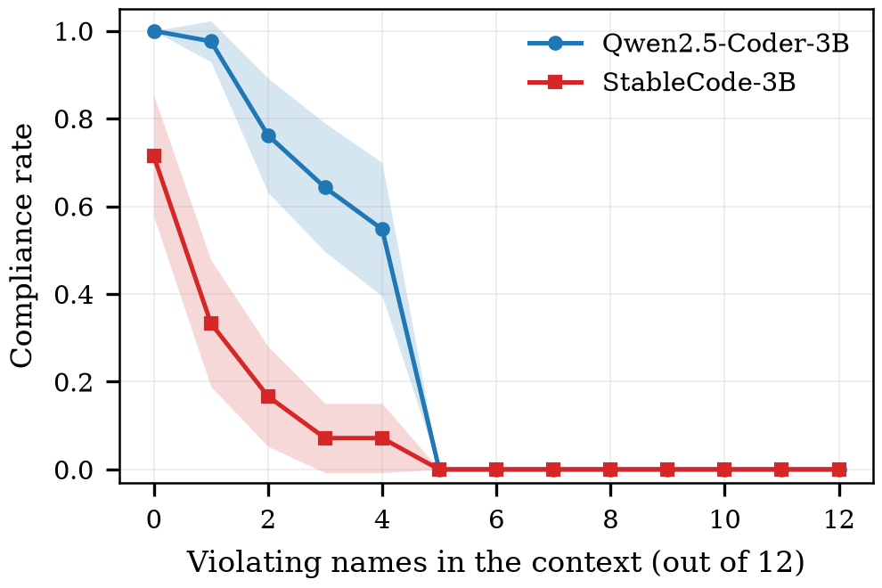
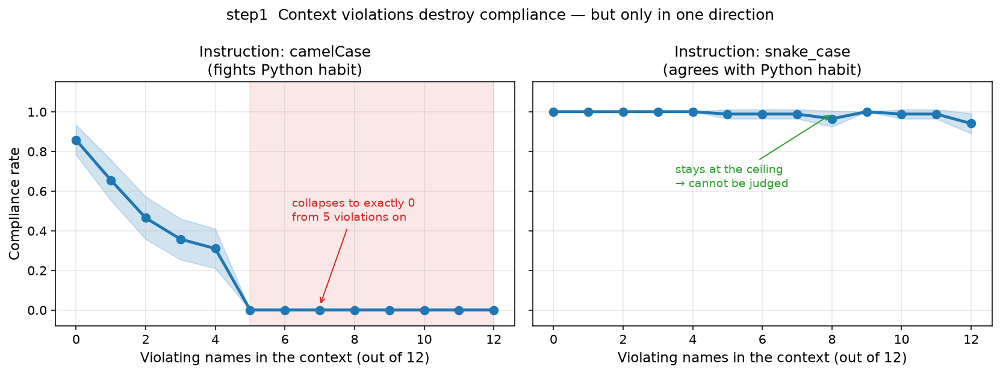

# step1 결과 — 문맥 위반과 준수율 (RQ1)

> **스텝:** step1 · **RQ:** RQ1 (문맥의 규약 위반이 준수율을 떨어뜨리는가)
> **결과:** `results/step1_cliff/` 4,368개 · **재현:** `python scripts/step1_reaggregate.py results/step1_cliff`
> **논문:** 그림 1 · A1

---

## 1. 결과 JSON 읽는 법

> 파일 하나 = **조건 하나**(모델 × 위반 개수 × 지침 방향 × 이름 묶음). 경로는
> `results/step1_cliff/<슬러그>.json`이고, 파일명만으로 조건이 복원된다.
> 공통 뼈대(`step`·`rq`·`condition`·`meta`)는 전 스텝이 같다. 그 값을 만드는 코드는 `src/harness/`.

### 1-1. 먼저 — 각 필드가 무엇을 말하는가

**밑바탕 개념**

| 말 | 정의 |
|---|---|
| **표기(notation)** | 함수 이름의 형태. `camel`(`removeDuplicates`) · `snake`(`remove_duplicates`) · `other`(둘 다 아님 — `RemoveDuplicates`, 한 단어 이름 등) |
| **목표 표기(target)** | 그 조건의 **지침이 요구한** 표기. 이것과 같으면 준수, 다르면 위반 |
| **턴(turn)** | 모델에게 함수를 써 달라고 한 횟수. **저장된 4,368개는 전부 1턴**이라 아래 배열은 길이가 1이다 |

**metrics 최상위** — 여섯 칸은 전 스텝 공용이라 이 스텝이 안 채우는 칸은 `null`이다.

| 필드 | 무슨 값인가 |
|---|---|
| `compliance_rate` | **준수율.** 모델이 새로 쓴 첫 함수 이름의 표기가 목표 표기와 같으면 `1.0`, 아니면 `0.0`. 파일 하나는 생성 1회이므로 0 아니면 1이고, 표에 실린 값은 **이름 묶음 42개 평균** |
| `compliance_preference` | `null` — 개입 스텝(step3·5·6)의 자리 |
| `attention_weight` · `v_norm` · `av_norm` · `v_cosine` | `null` — 관측 스텝(step2·4)의 자리. **step1은 모델 내부를 보지 않는다** |
| `per_layer` | `{}` — 층별 값이 없다(생성만 한다) |

**extra** — 이 스텝이 실제로 채우는 곳

| 필드 | 무슨 값인가 |
|---|---|
| `target` | 지침이 요구한 표기(`"camel"` / `"snake"`). 준수 판정의 기준 |
| `turn_names` | 모델이 실제로 쓴 함수 이름. **판정의 근거** |
| `turn_notations` | 그 이름을 정규식으로 판정한 표기(`camel`/`snake`/`other`) |
| `turn_texts` | 생성 원문 전체. 판정이 미심쩍으면 눈으로 검증한다 |
| `first_compliant` | 첫 함수가 목표 표기였나 (= `compliance_rate == 1.0`) |
| `first_violated` | 첫 함수가 목표를 어겼나 |
| `subsequent_violation_rate` | **2번째 턴부터의 위반 비율**(자기증폭 지표. "첫 함수가 위반일 때"라는 조건부는 집계 단계에서 건다). 1턴만 돌아서 **전부 `null`** — 즉 이 데이터로 자기증폭은 판정할 수 없다(→ §5) |

### 1-2. 실제 파일 모양

```jsonc
"metrics": {
  "compliance_rate": 0.0,              // 첫 함수가 목표 표기면 1.0
  "extra": {
    "target": "camel",                 // 지침이 요구한 표기
    "turn_notations": ["snake"],       // 턴별 판정. 길이 1 = 1턴만 돌았다
    "turn_names": ["remove_duplicates"],// 모델이 실제로 쓴 이름 ← 판정의 근거
    "turn_texts": ["def remove_dup…"], // 생성 원문. 눈으로 검증할 수 있다
    "first_compliant": false,
    "first_violated": true,
    "subsequent_violation_rate": null  // 1턴이라 항상 null
  }
}
```

### 1-3. 읽는 순서

1. `extra.target`을 본다 — 무엇을 요구한 조건인가.
2. `compliance_rate`를 본다 — 지켰나.
3. **0이면 반드시 `turn_names`를 함께 본다.** 0인 이유가 "snake를 썼다"인지
   "이름을 못 뽑았다(`other`)"인지는 여기서만 갈린다. `turn_notations`가 `"other"`면
   후자이고, 그 조건은 표기 위반이 아니라 **판정 실패**에 가깝다.
4. 조건별로 묶어 평균 내는 것은 `python scripts/step1_reaggregate.py results/step1_cliff`.

---

## 2. 무엇을 어떻게 쟀나

선행 코드 12개 함수 중 **지침과 다른 표기를 쓰는 함수의 수**를 0개에서 12개까지 바꿔 가며,
모델이 새로 생성한 **첫 번째 함수 이름의 표기**를 측정한다.

- **모델 4개** (Qwen2.5-Coder · DeepSeek-Coder · Llama-3.2 · StableCode), 이름 묶음 42개,
  지침 방향 2종, 시드 42 → 조건 4,368개
- 모든 값은 **42묶음 평균 ± 95% 신뢰구간**
- 언어는 파이썬

표기 규약을 명시한 지침은 **모든 조건에서 프롬프트의 첫 부분에 동일하게 유지**했다.
따라서 관측되는 변화를 만드는 것은 지침이 아니라 선행 코드의 구성이다.

> **접두사 처리가 모델마다 다르다.** Qwen2.5-Coder와 StableCode는 접두사를 고정하지 않았고,
> DeepSeek-Coder와 Llama-3.2는 `"def "`로 고정했다. 접두사를 포함하면 일부 모델에서 정상적인
> 생성이 이루어지지 않아 모델별로 다른 프롬프트를 채택한 결과다. **두 조건의 차이가 준수율에
> 미치는 영향은 검증하지 못했다**(논문 한계 절). 조건마다 어느 쪽이었는지는 결과 JSON의
> `metrics.extra.forced_prefix`로 확인할 수 있다.

---

## 3. 결과

### 3-1. 논문 그림 1 — `ko_cliff`

모델당 판 하나씩 네 판이다. 붉은 선이 camelCase를 요구한 조건, 회색 선이 snake_case를
요구한 조건이며, 각 점은 이름 묶음 42개에 대한 준수 비율이다.

```bash
python scripts/paper_figures_ko.py     # → docs/step1/figures/ko_cliff.pdf
```



논문에 실린 판은 `ko_cliff.pdf`(한글 라벨)이고, 위 `cliff.png`는 같은 데이터의 영문 라벨
판이다. 아래는 이해용으로 크게 그린 것으로, 모델을 합치고 지침 방향만 좌우로 나눴다.



### 3-2. camelCase를 요구한 조건 — 준수율이 무너진다

| 위반 개수 | Qwen2.5-Coder | DeepSeek-Coder | Llama-3.2 | StableCode |
|---|---|---|---|---|
| 0 | 1.000±0.000 | 0.976±0.046 | 1.000±0.000 | 0.714±0.137 |
| 1 | 0.976±0.046 | 0.976±0.046 | 0.952±0.064 | 0.333±0.143 |
| 2 | 0.762±0.129 | 0.929±0.078 | 0.429±0.150 | 0.167±0.113 |
| 3 | 0.643±0.145 | 0.929±0.078 | 0.238±0.129 | 0.071±0.078 |
| 4 | 0.548±0.151 | 0.810±0.119 | 0.286±0.137 | 0.071±0.078 |
| **5** | **0.000±0.000** | **0.190±0.119** | **0.048±0.064** | **0.000±0.000** |
| 6 | 0.000±0.000 | 0.095±0.089 | 0.048±0.064 | 0.000±0.000 |
| 7 | 0.000±0.000 | 0.048±0.064 | 0.048±0.064 | 0.000±0.000 |
| 8 | 0.000±0.000 | 0.048±0.064 | 0.024±0.046 | 0.000±0.000 |
| 9 | 0.000±0.000 | 0.048±0.064 | 0.000±0.000 | 0.000±0.000 |
| 10 | 0.000±0.000 | 0.024±0.046 | 0.000±0.000 | 0.000±0.000 |
| 11 | 0.000±0.000 | 0.000±0.000 | 0.000±0.000 | 0.000±0.000 |
| 12 | 0.000±0.000 | 0.000±0.000 | 0.000±0.000 | 0.000±0.000 |

**위반 5개 이상에서 네 모델 모두 준수율이 0.19 이하**로 미미해지며, 위반을 더 늘려도
회복되지 않는다.

**다만 감소가 가장 가파른 지점은 모델마다 다르다.**

| 모델 | 가장 가파른 구간 | 낙차 |
|---|---|---|
| Qwen2.5-Coder | 위반 4 → 5 | 0.548 → 0.000 |
| DeepSeek-Coder | 위반 4 → 5 | 0.810 → 0.190 |
| Llama-3.2 | 위반 1 → 2 | 0.952 → 0.429 |
| StableCode | 위반 0 → 1 | 0.714 → 0.333 |

Qwen2.5-Coder와 DeepSeek-Coder는 위반 4개와 5개 사이에서, StableCode와 Llama-3.2는
그보다 이른 구간에서 급락한다.

**기타 범주로 분류된 함수 이름은 하나도 관측되지 않았다.** 4,368개 전부 `camel`(877) 또는
`snake`(3,491)로 판정됐다. 관측된 0은 판정에 실패한 결과가 아니라 측정된 값이다.

### 3-3. snake_case를 요구한 조건 — 갈린다

| 위반 개수 | Qwen2.5-Coder | DeepSeek-Coder | Llama-3.2 | StableCode |
|---|---|---|---|---|
| 0 | 1.000±0.000 | 1.000±0.000 | 1.000±0.000 | 1.000±0.000 |
| 4 | 1.000±0.000 | 1.000±0.000 | 0.905±0.089 | 1.000±0.000 |
| 8 | 1.000±0.000 | 1.000±0.000 | 0.167±0.113 | 0.929±0.078 |
| 12 | 1.000±0.000 | 1.000±0.000 | **0.000±0.000** | 0.881±0.098 |

**코드 특화 모델 세 종**은 선행 코드가 모두 지침을 위반하더라도 높은 준수율을 유지한다.
**범용 모델 Llama-3.2는 이 조건에서도 준수율이 감소**하여 위반 12개에서 0이 된다.

---

## 4. 해석 (A1)

**선행 코드의 지침 위반 사례는 모델의 지침 준수율을 감소시켰다.**

지침을 동일하게 유지하면서 선행 코드의 표기만 변경했으므로, 관측된 변화는 선행 문맥의
구성에서 온 것이다.

**하락은 비례가 아니라 임계에 가깝다.** 일정 지점까지는 부분적으로 버티다가 한두 개 차이로
무너지며, 그 뒤로는 위반을 더 늘려도 회복하지 않는다. 다만 그 지점은 모델마다 다르다.

**지침이 모델의 기본 표기 선호와 충돌할 때 두드러진다.** 실험 대상 코드 특화 모델들은
전반적으로 snake_case를 선호한다. 지침이 snake_case를 요구하면 문맥이 전부 위반이어도
준수율이 유지된다. Python의 표기 관습이 함수 이름에 snake_case를 권고하므로, 이 선호는
학습 데이터의 분포가 반영된 결과로 추정된다.

**범용 모델은 다르게 움직인다.** Llama-3.2는 snake_case 조건에서도 준수율이 감소했다.
지침보다 선행 예시의 구성을 따르는 경향으로 보이며, 이 관측은 step4의 어텐션 배분
결과와도 이어진다.

---

## 5. 이 스텝이 다루지 않는 것

- **파이썬만.** 다른 언어에서 방향을 뒤집어 확인하지 않았다.
- **합성 프롬프트만.** 매개변수와 본문을 전 항목 동일하게 둔 합성 함수다. 실제 저장소
  코드에서의 재현은 확인하지 않았다.
- **첫 함수만.** 조건마다 한 번 생성했으므로, 위반이 뒤따르는 함수로 번지는지(자기증폭)는
  이 데이터로 판정할 수 없다. `subsequent_violation_rate`가 4,368개 전부 `null`이며,
  재계산이 아니라 재실행이 필요하다.
- **접두사 조건이 모델마다 다르다.** §2의 상자 참조. 전체 한계는
  [`../한계와_결함.md`](../한계와_결함.md)에 있다.

---

## 6. 다음 실험으로

준수율이 무너진다는 것까지가 이 스텝이다. **왜 무너지는지는 여기서 알 수 없다.**
생성 결과만 봐서는 선행 코드의 표기가 모델 안 **어느 경로로** 들어와 이름 선택을 바꾸는지
가릴 방법이 없다.

| 남은 질문 | 답하는 스텝 |
|---|---|
| 그 방해 신호가 모델 안에서 어디에 드러나나 | [`../step2`](../step2) — 어텐션·내부 표현 관측 (RQ2 관측) |
| 관측된 것이 **원인**인가 | [`../step3`](../step3) — Key/Value를 직접 바꿔 보는 인과 (RQ2 인과) |
| 지침 쪽은 왜 못 이기나 | [`../step4`](../step4)·[`../step5`](../step5) (RQ3) |

step6이 개입을 평가하는 **출발점(절벽 바닥, 위반 12/12)** 도 이 스텝이 정한다.
거기서 무개입 준수율이 0이기 때문에 처방의 효과를 0에서부터 잴 수 있다.
